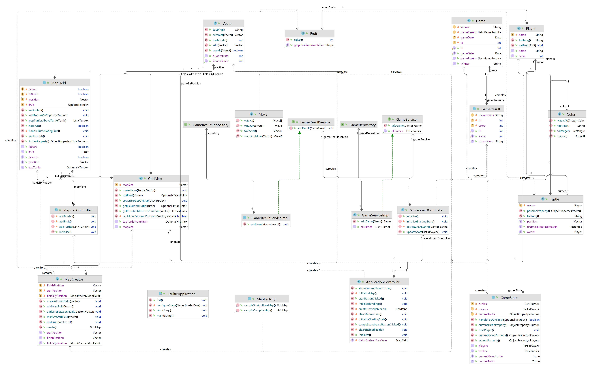

# rzulfie

#### Piotr Witek, Mateusz Wejman, Piotr Kowalczyk, Bartłomiej Chwast

In order to run application, use gradle script

## Changelog:
#### Milestone 2:
* added 2d map
* added fruits to the map
* changed turtle movement selection
* added points to scoreboard
* repackaged various elements
* fixed minor bugs

#### Milestone 1:
* created model with turtles, players and 1d map
* created games history persistence
* created view with player amount selection and table of winners
* added turtle movement
* added turtle representation on map
* added winner and end of the game detection
* added game re-start
* created unit tests for model

## Class diagram:

 
